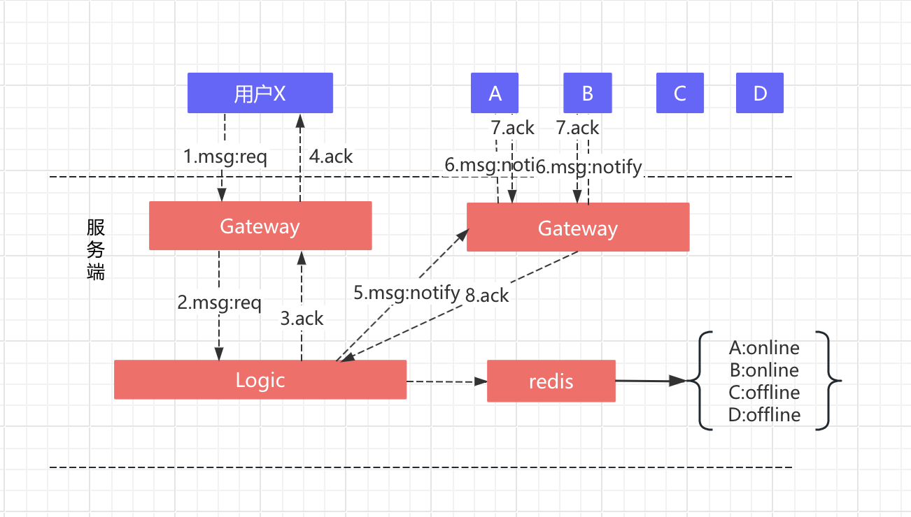

## IM sdk 架构

### IM核心

#### 1. 通信协议设计

**二进制协议**
：是指以二进制格式进行数据传输的协议。这种协议通常使用固定长度的包头和可扩展的变长包体。每个字段在协议中都有明确的含义。    
**特点**：

- 高效性: 由于数据以二进制形式传输，(二进制协议) 通常比文本协议更高效，能够更快地进行数据解析和传输。这对于需要快速响应的即时通讯应用尤为重要。
- 节省带宽：通常比文本协议占用更少的带宽，因为它不需要额外的字符（如空格、换行符等）来表示数据。
- 结构化: (二进制协议) 的数据结构通常是固定的，这使得解析过程更加简单和快速。每个字段的长度和含义在协议中是预先定义好的，减少了解析时的复杂性。
- 局限性: 可读性较差，不易于调试和手动检查。


数据处理：采用什么样的形式进行数据的处理更加高效？     
**Protobuf**
> 一种由Google开发的数据序列化协议，旨在高效地将结构化数据进行序列化和反序列化

**高效**：序列化后的数据体积小 & 序列化速度快。     
**跨语言支持**：Protobuf支持多种编程语言（如Java、C++、Python等），这使得不同平台和语言的系统能够方便地进行数据交换。

#### 2. 信令设计

信令命令用于在客户端和服务器之间进行有效的通信，对此作出简单的说明。   
2.1 心跳命令  
命令名称：心跳    
命令码：0x0001   
功能：用于检测客户端与服务器之间的连接状态。客户端定期发送心跳包，以保持连接的活跃性。

2.2 用户登录命令   
命令名称：用户登录   
命令码：0x0002   
功能：用户登录系统时发送的命令。服务器接收到此命令后，将验证用户身份并创建会话。
2.3 用户登出命令   
命令名称：用户登出   
命令码：0x0003   
功能：用户退出系统时发送的命令。服务器处理此命令以终止用户会话并释放相关资源。    
2.4 踢出用户命令   
命令名称：踢出用户   
命令码：0x0004   
功能：管理员或系统可以使用此命令将特定用户踢出系统。服务器将处理该命令并通知相关用户。

   ```
   //功能消息
   public final static short CMD_NOTICE_MSG = 0x0100;
   //功能消息确认
   public final static short CMD_NOTICE_MSG_ACK = 0x0103;
   // 根据群组id获取群组消息；返回数据在UserData ImGroup列表中;523
   public final static short CMD_GROUP_BY_ID = 0x0102;
   // 客户端发送IM消息，包括group消息和单聊消息
   public final static short CMD_IM_SEND_MSG = 0x0201;
   ...
   ```

#### 3.客户端和服务端通信

使用Netty作为高并发的网络框架进行客户端与服务区端通信。

3.1 
登录

1、客户端通过统一登录系统实现登录，得到token。   
2、客户端用uid和token向Gateway发起授权验证请求。   
3、Gateway同步调用Logic的验证接口   
4、Logic请求sso系统验证token合法性   
5、Gateway得到登录结果后，设置session状态，并向客户端返回授权结果。  

登出

1、客户端发起logout请求，Gateway设置对应Peer为未登录状态。   
2、Gateway给客户端一个ack响应。   
3、Gateway通知Logic用户登出。   
踢出


上报(c2s)流程原理

1、客户端向Gateway发送数据；   
2、Gateway回一个ack包，向客户端确认已经收到数据；   
3、Gateway将数据包传递给Logic；   
4、Logic根据数据投递目的地，选择对应的mq队列进行投递；   
5、业务服务器得到数据。

推送(s2c)流程原理

1、业务线调用push数据接口sendMsg    
2、Logic向redis检索目标用户状态。如果目标用户不在线，作为离线功能性消息存储）；如果用户在线，查询到用户连接的接入层Gateway    
3、Logic向用户所在的Gateway发送数据    
4、Gateway向用户推送数据。   
5、客户端收到数据后向Gateway发送ack反馈。   
6、Gateway将ack信息传递给Logic层，用于其他可能的逻辑处理（如日志，确认送达等）   

3.2 单聊

1、用户A向Gate1发送信息（信息最终要发给用户B）   
2、Gate1将信息投递给Logic   
3、逻辑服务器收到信息后，将信息进行存储   
4、存储成功后，Logic向Gate1发送ack   
5、Gate1将ack回执发给用户A   
6、Logic检索redis，查找用户B状态。如果用户B登录，流程结束  
7、如果用户B登录到了Gate2，logic将消息发往Gate2   
8、Gate2将消息发给用户B（如果发现用户B不在线，作为离线消息进行存储，离线消息可保证消息不丢）   
9、用户B向Gate2发送ack    
10、Gate2将ack信息发给Logic    
11、Logic将消息状态设置为已送达。

3.3 群聊

采用扩散写（而非扩散读）的方式。

群聊是多人社交的基本诉求，一个群友在群内发了一条消息：   
1）在线的群友能第一时间收到消息；   
2）离线的群友能在登陆后收到消息。

业务场景举例：
1）一个群中有x,A,B,C,D共5个成员，成员x发了一个消息；
2）成员A与B在线，期望实时收到消息；
3）成员C与D离线，期望未来拉取到离线消息。

群聊流程详细说明：   
1、X向Gateway发送信息（信息最终要发给这个群，A、B在线）。   
2、Gateway将消息发给Logic    
3、存储消息到表中   
4、回ack     
5、回ack   
6、Logic检索数据库（需要使用缓存），获得群成员列表   
7、查询用户在线状态   
8、Logic向Gateway投递消息   
9、Gateway向用户投递消息    
10、App返回收到消息的ack信息    
11、Gateway向Logic传递ack信息    

3.4 离线消息的拉取

1、App端登录成功后会触发拉取离线群，然后分页拉取离线消息，主要参数涉及到groupId、receiveSeqId。
2、为了防止过多的离线消息积累造成数据处理问题，离线消息的拉取只会拉取最新的一页(20条msg)，待进入聊天页面之后，在进行分页拉取。
3、断网情况会进行重新连接，每隔5s进行重连一次，尝试20次。如果连接成功，进行pullGroup和pullMsg拉取（在聊天页面只需拉取所在群的即可），
连接失败，则通过网络监听，获取网络状态变化，进行重新连接。

#### 4. 存储设计

x_message

| 字段           | 字段类型   | 描述                                                        |
|--------------|--------|-----------------------------------------------------------|
| msgId  | string | primaryKey (uuid)                                         |
| msgType  | int | 消息类型；1:文本、2:语音、3:图片、4:视频、5:位置、6:附件、7:名片、8:频道公告、99:消息透传... |
| msgBody  | string |                                                           |
| sendTime  | long |                                                           |
| senderId  | long |                                                           |
| senderName  | string |                                                           |
| senderRemark  | string |                                                           |
| status  | int |STATUS_SUCCESS = 0 STATUS_SENDING = -1 STATUS_FAILURE = -2 STATUS_RECVREAD = -3 STATUS_RECVUNREAD = -4                                                           |
| msgStatus  | int |normal = 0; delete = 1; revoke = 2;                                                           |
| extra  | String |                                                           |
| attachId  | long |                                                           |
| attachType  | int |                                                           | 
| attachName  | String |                                                           |   
| attachUrl  | String |                                                           |      
| attachSize  | int |                                                           |   
| whetherNonCount  | int |                                                           |   
| groupId  | String | @DatabaseField(index = true) 添加对groupId字段的索引，加快基于groupId的查询速度   |   
| groupType  | int |                                                           | 
| groupName  | String |                                                           | 

    
x_conversation

| 字段          | 字段类型   | 描述                                                    |
|-------------|--------|-------------------------------------------------------|
| groupId     | string | @DatabaseField(columnName = "groupId", unique = true) |
| groupType   | int    | Single = 1 Group = 2 System = 3;                      |
| groupName   | string |                                                       |
| avatar      | string |                                                       |
| lastMessage | string |                                                       |
| senderName  | string |                                                       |
| senderRemark  | string |                                                       |
| sendTime  | long   |                                                       |
| initSeq  | long   |         进群时seqid                                            |
| maxSeq  | long   |           最大seqid                                          |
| readSeq  | long   |           已读seqid                                         |
| isShield  | int    |          是否免打扰                                        |
| isQuit  | int    |          是否被踢                                     |
| extra  | string |          是否被踢                                     |


#### 5. 其他：    

 5.1、聊天消息id的生成？    
    聊天消息的id 生成采用uuid。    
 5.2、消息保障机制？
    聊天消息的发送规定为15s超时，超时认定发送失败，更新消息状态，手动触发重新发送。消息进入发送消息队列，有发送消息队列FIFO
发送，并会在本地生成traceId监听是否收到ack回执，这个ack在Ack队列当中。在15s内会检测是否有收到的ack_traceid= send_traceId;
 5.3、如何保证消息不丢失？    
    1）拉取离线消息
    2）分页加载消息的时候，如果有丢失消息，进行消息补全；    
 例如：一页加载20条数据，计算数据头尾（头SeqId - 尾seqId = size -1 ）是否连续，不连续代表丢消息，调用接口获取丢失的消息。      
 5.4、心跳和空闲检测     
 连接假死现象：在某一端（服务端或者客户端）看来，底层的 TCP 连接已经断开了，但是应用程序并没有捕获到，因此会认为这条连接仍然是存在的。     
 连接假死会带来以下两大问题：     
 1）对于服务端来说，因为每条连接都会耗费 cpu 和内存资源，大量假死的连接会逐渐耗光服务器的资源，最终导致性能逐渐下降，程序奔溃。       
 2）对于客户端来说，连接假死会造成发送数据超时，影响用户体验。        
 解决办法：    
 1、添加服务端空闲检测 ：15s未读到数据判定TCP 连接已经断开了，关闭连接。    
 2、在客户端添加心跳 ：每隔 5 秒，向服务端发送一个心跳数据包，这个时间段通常要比服务端的空闲检测时间的一半要短一些，
我们这里直接定义为服务端空闲检测时间的三分之一，主要是为了排除公网偶发的秒级抖动。    
 3、同样客户端也需要添加空闲检测 ：15s未读到数据判定TCP 连接已经断开了，关闭连接，启动重连机制。    


 

 
  
